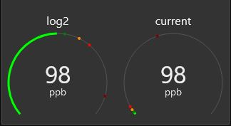
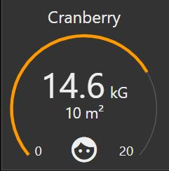

# node-red-contrib-ui-artless-gauge


[![NPM version][npm-image]][npm-url]
[](https://www.codefactor.io/repository/github/hotnipi/node-red-contrib-ui-artless-gauge)


[npm-image]: http://img.shields.io/npm/v/node-red-contrib-ui-artless-gauge.svg
[npm-url]: https://www.npmjs.com/package/node-red-contrib-ui-artless-gauge


## Description


Artless gauge is gauge with minimal design. Gauge has two layouts - linear and radial. Both layouts support regular mode and differential mode. With differential mode, the indicating colored track is drawn from center to side. 


## Configuration
### Size
For linear layout the supported height is up to 2 units. 
For radial mode the minimal size is 2x2 units. Supported size configuration for radial layout is square (3x3, 4x4, ...). Widget forces different size combinations to be square, based on shortest side.

### Input 
Configured input property (default is <code>msg.payload</code>) should carry single numeric value.

### Label
Label can be any string. Label field does not support any html for color or size adjustments.

### Icon
Supported icons are same as for dashboard: [Font Awesome 4.7](https://fontawesome.com/v4.7.0/icons/), [Material Icons](https://material.io/resources/icons/?style=baseline) and [Weather icons lite](https://github.com/Paul-Reed/weather-icons-lite). If your setup has internet connection, you can also use [Iconify icons](https://iconify.design/). To use Iconify icons, use prefix <code>iconify-</code> and you'll need to add the API to the dashboard site head

```javascript
<script src="https://code.iconify.design/1/1.0.7/iconify.min.js"></script>
``` 

<p>Any type of icon accepts additional classes. For example you can animate <code>iconify-mdi:fan</code> by adding <code>fa-spin</code>.

### Layout
Choose layout type. Layout can be linear or radial.

### Mode
Option to turn on differential mode. With this option selected, the colored track has center point from which the value is shown. Value of center point can be adjusted. If center value is not defined, the center point is exactly between configured min and max.

### Range
Configure minimum and maximum expected values and adjust line color. Add segments and configure colors for them if needed. Note that MIN and MAX options can not be removed. A small dot with segment color can be drawn at the point of segment. To show dot for segment, configure size for dot bigger that zero.

### Animate
You can turn on or off the animations of the colored bar. 
    
### log2
You can turn on or off a function that is used the base-2 logarithm to calculate the value.
    



### Line width
You can adjust thickness of the colored bar. The range of possible values depends on layout and configured size.

### Line style
You can make the colored bar to be dashed line. Provided comma separated list of numbers makes pattern of dash-array.
First number represents dash width, second number represents gap width.

<code>
    2, 2
</code> 

In addition there is option to make dash ends to be round by adding the word "round" to the end of list. 
To get perfetly round dots, configure dash width to 0 and gap width equal or a bit larger than Line width. 
<p>
<code>
    0, 8, round
</code> 

See more about [stroke dash-array](https://developer.mozilla.org/en-US/docs/Web/SVG/Attribute/stroke-dasharray)


### Track color
Color of track background line can be configured. By default, the site colors used.

### Tickmarks
Min and max values can be shown near the track.
For differential mode, also the center value is shown.
With radial layout the tickmarks can be shown only if layout size is 3x3 units or more.

### Round value 
Value is always rounded according to the configured decimals. Default is zero so value presented as integer. 

### Unit
Unit is displayed near the value field. Unit can be any string. For radial layout by default the unit is shown below the value field. The unit can be shown inline with the value. By using this option, there will be secondary value field available to show any string below the main value field.



### Secondary input
Secondary input is available only for radial layout and if uint is placed inline with value field.

Value for configured secondary input property (default is <code>msg.secondary</code>) should be string or number.

For sure the data for secondary input does not change with same rate as the main data. You may, but there is no need to send it always. But be aware that if you change dashboard tabs or do refresh, the secondary field may be empty because of last message what is replied to gauge may then miss the data for secondary field. The artless-gauge does not store that data as configured unit or similar. It depends on incoming message. So if you don't send data with every input, you can use the <code>ui_control</code> node to inject the flow to retrieve last known value for secondary field and send it when dashboard connects or changes the tab.
 

## Change the configuration at runtime

Many options of widget configuration can be overrided at runtime using the <code>msg.control</code> property.
You can send options one by one, or all together.
Note, that min and max must be part of sectors property.
Change of min or max will not affect sectors if they were configured. But any sector update clears all previously configured sectors except the min and max.
There is no validation on top of incoming sectors configuration.

#### Configurable options and value types

``` javascript
sectors - Array of Object´s
unit - String
label - String
icon - String
center - Number
decimals - Number
```
#### Example
``` javascript
var newSectors = [{t:"min",val:5,col:"#00ff00",dot:3},{t:"sec",val:8,col:"#ff0000",dot:3},{t:"max",val:30,col:"#0000ff",dot:3}]
msg.control = {unit:"degrees",label:"Temperature",icon:"fa-thermometer",center:4, decimals:1, sectors:newSectors}
```
 

## Licence

This node uses GreenSock animation library GSAP licenced with Standard GreenSock License for non-commercial use https://greensock.com/standard-license/

